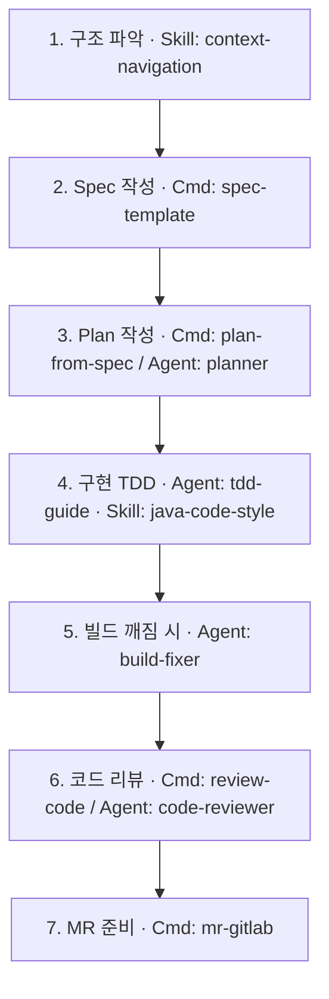
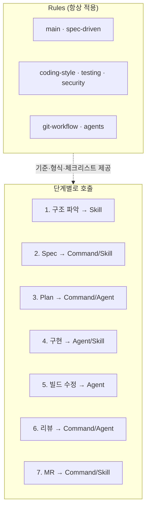
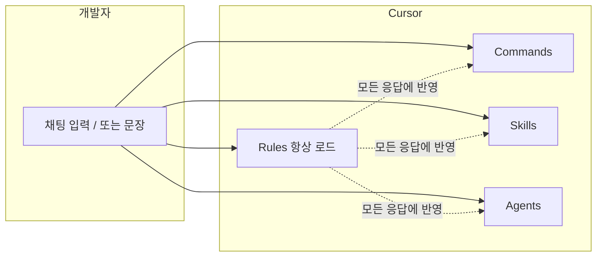

# cursor-agent-boilerplate (wooree)

> **확장 가능한** Cursor IDE용 에이전트 보일러플레이트입니다.  
> Spec-Driven Development, TDD, 코드 리뷰·Git 워크플로우를 Cursor에서 규칙·명령·스킬·서브에이전트로 사용할 수 있습니다.  
> 백엔드(Java/Spring) 예시를 포함하며, **포지션(백엔드, 프론트 웹·Next.js, 프론트 모바일·Flutter, QA, 인프라, 기획, 디자인)별로 복사해 커스터마이즈**할 수 있습니다.

## 1. 개요

- **대상**: Cursor IDE에서 개발 시 AI 보조를 쓰는 경우 (백엔드 템플릿 포함, 다른 포지션으로 확장 가능)
- **내용**: Spec-Driven Development, TDD, 코드 리뷰·Git 워크플로우를 Cursor에서 "지시문" 또는 슬래시로 실행할 수 있도록 정리한 규칙·스킬·프롬프트 가이드
- **실제 개발 시**: 아래 **6. 실제 개발 작업 시 사용 가이드**에서 단계별 사용법(무엇을 말하고/호출하면 되는지)이 정리되어 있습니다.
- **문서**: 프롬프트 모음·실무 적용·Slack 연동 등 상세 문서는 **[docs/](docs/)** 폴더에 있습니다. **바로 해보기 전** Slack·Cursor·Figma·Stitch 등 연동·세팅 체크리스트는 **[docs/GETTING_STARTED_CHECKLIST.md](docs/GETTING_STARTED_CHECKLIST.md)**.
- **확장성**: 포지션별 **도구·MCP·기술 스택**은 해당 포지션의 **TOOLS_AND_MCP.md**에 추가하면 됩니다. (예: frontend-web — [Agentation](https://benji.org/agentation), Figma/Stitch MCP). 전체 가이드: **[docs/EXTENSIBILITY.md](docs/EXTENSIBILITY.md)**.
- **에이전틱 엔지니어링**: 에이전트가 더 똑똑·효율적으로 동작하도록 [생존 스킬 9가지](https://news.hada.io/topic?id=27104)(분해·DoD·실패 복구·감각 등)를 반영한 원칙은 **[docs/AGENTIC_ENGINEERING.md](docs/AGENTIC_ENGINEERING.md)**. 개발 포지션(backend, frontend-web, frontend-mobile)의 `.cursor/rules/agentic.mdc`에서 참조됩니다.
- **AI 사일로 조직 비전**: 토스식 사일로를 AI 에이전트로 재현하려는 목표와, 현재 보일러플레이트로 그 목표에 도달할 수 있는지에 대한 분석·아키텍처·로드맵은 **[docs/SILO_AGENT_VISION.md](docs/SILO_AGENT_VISION.md)**.
- **실전 B Phase 2a**: **Slack + Cursor 연동**만으로 진행. 슬랙 대화창에서 **@Cursor** 호출하면 Cloud Agent가 실행되며, 별도 봇 코드는 없음. 템플릿은 **[docs/PHASE2A_CURSOR_SLACK.md](docs/PHASE2A_CURSOR_SLACK.md)**·[AGENT_MESSAGE_PROTOCOL.md](docs/AGENT_MESSAGE_PROTOCOL.md) §6 참고.

## 2. 설치 및 사용

### 2.1 포지션별 폴더 구조 (이 레포는 포지션별로 관리됩니다)

이 레포는 **포지션별 하위 폴더**로 구성되어 있습니다. 실제로 작업할 때는 **해당 포지션 폴더를 Cursor에서 Open** 해주세요.

| 폴더 | 용도 |
|------|------|
| **backend/** | 백엔드(Java/Spring). `.cursor/`·AGENTS.md·플러그인 등 **전체 구현** 포함 |
| **frontend-web/** | 프론트엔드(웹·Next.js). rules·skills·commands·agents 포함(Next.js·a11y·컴포넌트·테스트) |
| **frontend-mobile/** | 프론트엔드(모바일·Flutter). rules·skills·commands·agents 포함(Flutter·위젯·ViewModel·테스트) |
| **qa/** | QA/테스트. 시나리오·회귀범위·버그템플릿·자동화 규칙·commands·agents 포함 |
| **infra/** | 인프라/DevOps. IaC·Terraform·보안·런북 규칙·commands·agents 포함 |
| **pm/** | 기획/PM. 스펙·이슈·태스크 분해·리스크 규칙·commands·agents 포함 |
| **design/** | 디자인/브랜딩. 디자인시스템·토큰·접근성 규칙·commands·agents 포함 |

- **백엔드 작업 시**: Cursor에서 **`cursor-agent-boilerplate/backend`** 폴더를 Open → `.cursor/commands/`, `.cursor/agents/` 등이 적용됩니다.
- **다른 포지션 작업 시**: 해당 폴더(예: `frontend-web`)를 Open → 해당 포지션의 `.cursor/rules/main.mdc`와 AGENTS.md가 적용됩니다.
- **플러그인**: **모든 포지션 폴더**에 `.cursor-plugin/plugin.json`이 있으므로, 각 포지션 폴더는 **Cursor 플러그인 소스**로 사용할 수 있습니다. 실무 레포에서 해당 포지션을 플러그인으로 추가하거나, 규칙을 복사해 넣으면 됩니다.

### 2.2 프로젝트에 포함 (클론 후 사용)

1. 이 레포를 클론합니다.
2. **Cursor**에서 **작업할 포지션 폴더**를 엽니다 (예: `backend` 또는 `frontend-web`).
3. **슬래시 명령**: 채팅 입력창에 `/`를 입력하면 해당 폴더의 `.cursor/commands/`에 정의된 명령이 목록으로 뜹니다. (백엔드 폴더에는 `/plan-from-spec`, `/review-code`, `/mr-gitlab` 등이 있음.)
4. **지시문**: 슬래시 없이 쓰고 싶다면 아래 **지시문·워크플로우** 섹션에 정리된 문장을 그대로 입력해도 같은 워크플로우를 실행할 수 있습니다.
5. **포지션을 잘 모를 때 — 역질문**: 기획·디자인·QA 등 다른 포지션에서 "뭐 할 수 있어?"만 해도 되도록, 각 포지션에 **`/start`** 명령과 **PROMPT_TEMPLATES.md**가 있습니다. `/start`를 입력하면 에이전트가 **자주 하는 작업 옵션**을 보여 주고 **역으로 질문**해, 선택만 하면 해당 작업을 진행합니다. 슬랙에서 Boss가 지시할 때도 봇이 이 템플릿을 채널에 전달하면 포지션별 에이전트가 유기적으로 동작합니다. 자세한 내용: **[docs/INTEGRATION.md §4](docs/INTEGRATION.md)** (슬랙·Boss 고도화).

### 2.3 실무 레포에서 사용 (플러그인 vs 복사)

- **플러그인**: 각 포지션 폴더(backend, frontend-web, …)에 `.cursor-plugin/`이 있으므로, **해당 포지션 폴더를 Cursor 플러그인 소스로 지정**하면 실무 레포에서 그 포지션의 규칙·명령·스킬·에이전트를 사용할 수 있습니다. Cursor에서 "플러그인 추가" 시 이 레포의 해당 포지션 폴더 경로를 지정하거나, 마켓플레이스에 포지션별로 등록해 두었다면 해당 플러그인을 설치하면 됩니다.
- **복사**: 사용할 포지션 폴더의 `.cursor/`와 `AGENTS.md`를 실무 레포 루트에 복사해 넣어도 됩니다. 레포별로 규칙을 많이 커스터마이즈할 때 유리합니다.
- **Slack 봇과 팀 워크플로우**: 실무 레포에 세팅이 끝난 뒤, Slack 봇과 Git 웹훅으로 "기획 → 개발 → 리뷰 → QA → 배포"가 유기적으로 이어지는 방법은 **[docs/INTEGRATION.md](docs/INTEGRATION.md)** 에 정리되어 있습니다.

### 2.4 Cursor 플러그인으로 설치 (마켓플레이스)

[Cursor 플러그인](https://cursor.com/ko/docs/plugins) 형식으로도 제공됩니다. 각 포지션 폴더마다 `.cursor-plugin/plugin.json`이 있어, [Cursor Marketplace](https://cursor.com/marketplace)에 **포지션별로** 등록한 경우 해당 **플러그인**을 설치해 사용할 수 있습니다. (제출: [cursor.com/marketplace/publish](https://cursor.com/marketplace/publish))

### 2.5 Rules·Commands·Skills·Agents — 뭔지, 언제 쓰는지

| 구분 | 뭔가요? | 언제 쓰나요? | 화면에서 어떻게 쓰나요? |
|------|---------|--------------|--------------------------|
| **Rules (규칙)** | AI가 **항상 참고하는** 코딩·Git·테스트/보안 규칙. 프로젝트에 있으면 Cursor가 알아서 읽어요. | **별도로 "쓰는" 게 아님.** 해당 파일 타입·세션에 따라 자동 적용됨. | 채팅에 뭐라고 입력할 필요 없음. 프로젝트를 Cursor로 열어 두면 적용됨. |
| **Commands (명령)** | "이걸 해줘" 같은 **한 번에 실행할 작업** 정의. 예: plan 만들기, 코드 리뷰, MR 설명 초안. | **Spec/Plan/리뷰/MR** 같이 "지금 이 작업 해줘" 할 때. | 채팅 입력창에 **`/`** 입력 → 목록에서 `plan-from-spec`, `review-code`, `mr-gitlab` 등 **선택**하거나, **같은 뜻의 문장**을 그냥 입력해도 됨. |
| **Skills (스킬)** | **특정 주제**에 맞는 지식·절차(예: spec 작성법, 코드 스타일, DB 리뷰). 에이전트가 그걸 "참고"해서 답함. | 구조 파악, spec 초안, 코드 스타일/DB 리뷰 등 **그 주제로** 도움받고 싶을 때. | **`/`** 입력 후 스킬 이름 **선택**하거나, 채팅에 "AGENTS.md 보고 구조 파악해줘"처럼 **문장으로** 요청해도 됨. |
| **Agents (서브에이전트)** | **역할이 정해진** 에이전트(계획 담당, 리뷰 담당, 빌드 수정 담당 등). 그 역할에 맞는 프롬프트가 이미 들어 있음. | **역할을 지정해서** 일을 맡기고 싶을 때. | **`/`** 입력 후 `planner`, `code-reviewer`, `build-fixer` 등 **선택**하거나, "plan.md 작성해줘", "코드 리뷰해줘"처럼 **문장으로** 요청해도 됨. |

**한 줄로:**  
- **Rules** = 자동 적용 (직접 "쓰는" 게 아님)  
- **Commands** = "지금 이 작업 해줘" → **`/`로 명령 선택** 또는 **문장 입력**  
- **Skills** = 주제별 지식 → **`/`로 스킬 선택** 또는 **문장 입력**  
- **Agents** = 역할별 → **`/`로 에이전트 선택** 또는 **문장 입력**

### 2.6 맥북 Cursor 화면에서의 사용 흐름 (슬래시 vs 대화창 입력)

1. **Cursor 실행** → 프로젝트 폴더 열기.
2. **채팅 열기**: `Cmd + L` 또는 채팅 아이콘 클릭 → **입력창**이 보임.
3. **방법 A — 슬래시**: 입력창에 **`/`** → 명령·스킬·서브에이전트 목록에서 선택.
4. **방법 B — 문장 입력**: 슬래시 없이 문장만 입력 (예: *"지금 디렉터리 spec.md 읽고 구현 계획 plan.md 만들어줘. Phase·TDD·리뷰 포함해줘."*).
5. 둘 다 **같은 채팅 입력창**에서 사용하며, **Rules는 항상 백그라운드로 적용**됩니다.

**참고:** 단계별 문장 예시는 아래 **6. 실제 개발 작업 시 사용 가이드**를 참고하면 됩니다.

### 2.7 실제 작업에서의 유기적 동작 예시

**상황:** 새 기능(예: API·서비스)을 추가한다고 가정합니다. 각 단계에서 Rules·Commands·Skills·Agents가 어떻게 함께 동작하는지 보여줍니다.

| 단계 | 개발자가 하는 일 | Rules | Commands / Skills / Agents | 동작 요약 |
|------|------------------|--------|----------------------------|-----------|
| **1. 구조 파악** | *"AGENTS.md 보고 이 프로젝트 구조 파악한 다음, [기능명] 넣을 위치 알려줘"* | main, agents 로드 → 워크플로우 유도 | **Skill** `context-navigation` 또는 문장 요청 | Rules가 맥락을 주고, Skill/문장이 구조 파악을 구체화 |
| **2. Spec 작성** | `/spec-template` 또는 *"지금 기능에 맞는 spec.md 초안 만들어줘"* | spec → plan → task 순서 유지 | **Command** `spec-template`, **Skill** `spec-template` | Command/Skill이 실행, Rules가 형식·흐름 맞춤 |
| **3. Plan 작성** | `/plan-from-spec` 또는 *"spec.md 읽고 plan.md 만들어줘. Phase·TDD 포함해줘"* | plan에 Phase·TDD·리뷰 포함 유도 | **Command** `plan-from-spec`, **Agent** `/planner` | Command/Agent가 계획 생성, Rules가 기준 반영 |
| **4. 구현 (TDD)** | *"plan.md Phase N만 TDD로 구현해줘"* 또는 `/tdd-guide` | coding-style, testing, security 자동 적용 | **Agent** `tdd-guide`, **Skill** `java-code-style` | Rules가 품질 기준, Agent/Skill이 구현·스타일 담당 |
| **5. 빌드 깨짐** | *"이 에러 원인 찾고 수정안 제안해줘"* 또는 `/build-fixer` | 테스트·스타일 유지 | **Agent** `build-fixer` | Agent가 원인·수정, Rules가 제안이 규칙을 따르게 함 |
| **6. 코드 리뷰** | *"이번에 수정한 코드 리뷰해줘"* 또는 `/review-code` / `/code-reviewer` | 리뷰 시 확인 항목 제공 | **Command** `review-code`, **Agent** `code-reviewer` | Command/Agent가 리뷰, Rules가 기준 통일 |
| **7. MR 준비** | *"staged 기준으로 커밋·MR 설명 초안 만들어줘"* 또는 `/mr-gitlab` | 커밋·MR 규칙 반영 | **Command** `mr-gitlab`, **Skill** `gitlab-workflow` | Command/Skill이 문안 작성, Rules가 관례 유지 |

**흐름 시각화 (1) — 작업 단계 순서**

**흐름 시각화 (2) — Rules는 항상, Commands/Skills/Agents는 단계별로**

**흐름 시각화 (3) — 한 세션 안에서의 관계**

## 3. 폴더 구조

**루트** (이 레포 루트):

| 폴더/파일 | 용도 |
|-----------|------|
| **backend/** | 백엔드 포지션. `.cursor/`, `.cursor-plugin/`, AGENTS.md 전체 구현 |
| **frontend-web/**, **frontend-mobile/**, **qa/**, **infra/**, **pm/**, **design/** | 각 포지션 폴더. `.cursor/rules/`·commands·skills·agents·AGENTS.md 포함(실무 best practice 반영) |
| **README.md** | 전체 안내·설치·사용·폴더 구조 |
| **docs/** | 문서 폴더 (아래 참고) |
| **.gitignore** | 공통 ignore |

**docs/ 하위:**

| 문서 | 용도 |
|------|------|
| **docs/README.md** | docs 목차 |
| **docs/PROMPTS.md** | Cursor 대화창용 프롬프트 모음 |
| **docs/INTEGRATION.md** | 실무 레포 적용(플러그인/복사)·Slack 봇 연동·팀 워크플로우 |
| **docs/EXTENSIBILITY.md** | 확장성 — 포지션별 도구·MCP·기술 스택·Slack 추가 |
| **docs/SETUP_REPOS.md** | 포지션별 기본 레포 세팅(Java/Spring, Next.js, Flutter)·.cursor 기술 스택 검증 |
| **포지션별 /setup-repo** | **에이전트 대화창**에서 실행: 해당 포지션 폴더(backend, frontend-web, frontend-mobile)를 연 뒤 채팅에 `/setup-repo` 또는 "새 레포 세팅해줘" 요청 → 프로젝트명 입력 시 자동 생성·복사. |

**포지션 폴더 안** (예: `backend/`):

| 폴더/파일 | 용도 |
|-----------|------|
| **.cursor/rules/** | Cursor가 **자동 로드**하는 규칙 (.mdc) |
| **.cursor/commands/** | 슬래시 명령 (백엔드에만 구현됨, 다른 포지션은 확장 시 추가) |
| **.cursor/skills/** | 에이전트 스킬 (백엔드에만 구현됨) |
| **.cursor/agents/** | 서브에이전트 (백엔드에만 구현됨) |
| **.cursor-plugin/** | Cursor 플러그인 매니페스트 (각 포지션에 있음) |
| **AGENTS.md** | 해당 포지션의 spec → plan → task·공통 맥락 |
| **TOOLS_AND_MCP.md** | (선택) 해당 포지션 추천 도구·MCP·기술 스택. frontend-web·design 예시 있음. 확장 시 추가. |
| **SETUP.md** | (개발 포지션) 해당 기술 스택으로 새 레포 만드는 절차. backend·frontend-web·frontend-mobile에 있음. 상세·검증: docs/SETUP_REPOS.md. |

## 4. 지시문·워크플로우 (슬래시 대신)

| 목적 | Cursor에서 할 말 (예시) |
|------|-------------------------|
| **Spec 초안** | "지금 기능에 맞는 spec.md 초안 만들어줘. 목표, 요구사항, 제약사항 포함해줘." |
| **Plan 생성** | "지금 디렉터리(또는 현재 폴더)의 spec.md 읽고, 구현 계획 plan.md 만들어줘. Phase 나누고 TDD·리뷰·커버리지까지 포함해줘." |
| **코드 리뷰** | "이번에 수정한 코드(또는 이 경로) 코드 리뷰해줘. 아키텍처·품질·테스트·보안 기준으로." |
| **MR 설명 초안** | "staged 파일만 기준으로 커밋 메시지 초안이랑 MR 설명 초안 만들어줘. 리뷰 요약도 포함해줘." |
| **Plan으로 구현** | "plan.md의 Phase N만 TDD로 구현해줘." / "이 Phase 끝났어. task.md 다음 항목 진행해줘." |

## 5. 활용 방법

- **규칙**: `.cursor/rules/` 안의 .mdc가 자동 적용됩니다.
- **슬래시**: 채팅에서 `/` 입력 시 `.cursor/commands/` 명령과 `.cursor/agents/` 서브에이전트, `.cursor/skills/` 스킬이 목록에 뜹니다.
- **지시문**: 위 표나 **6. 실제 개발 작업 시 사용 가이드**의 문장을 채팅에 붙여 넣어도 됩니다.

## 6. 실제 개발 작업 시 사용 가이드

- **준비**: 레포 클론 후 Cursor에서 **작업할 포지션 폴더**를 엽니다 (예: `backend` 또는 `frontend-web`). 다른 프로젝트에 적용할 때는 해당 포지션 폴더의 `.cursor/`와 `AGENTS.md`를 복사해 사용하면 됩니다.
- **새 기능 시작**: 구조 파악 → Spec 초안 → Plan → 구현(TDD) → 리뷰 → MR 준비 → 문서 동기화.  
  단계별 **채팅에 할 말** 예시는 README 본문 및 **[docs/PROMPTS.md](docs/PROMPTS.md)** 를 참고하세요.

## 7. 다른 프로젝트·포지션에 적용할 때

- **실무 레포에 적용**: 이 레포의 **포지션 폴더**(예: `backend/`) 안의 **.cursor/** (rules + commands + skills + agents)와 **AGENTS.md**를 실무 레포로 복사해 넣으면, Cursor에서 동일한 규칙·명령·스킬·서브에이전트를 사용할 수 있습니다.
- **포지션별 확장**: 이 레포는 이미 **backend, frontend-web, frontend-mobile, qa, infra, pm, design** 폴더로 나뉘어 있습니다. 각 폴더를 Cursor로 열면 해당 포지션 규칙이 적용됩니다. 다른 포지션 폴더는 최소 규칙만 있으므로, `backend/` 구조를 참고해 commands/skills/agents를 채우면 됩니다.

## 8. 확장·커스터마이즈

- 이 레포는 **보일러플레이트**입니다. 회사명·프로젝트명 없이 그대로 복제해 사용할 수 있습니다.
- Cursor 플러그인으로 배포하려면 `.cursor-plugin/plugin.json`의 `name`, `description`, `repository` 등을 수정한 뒤 [cursor.com/marketplace/publish](https://cursor.com/marketplace/publish)에 제출하면 됩니다.
