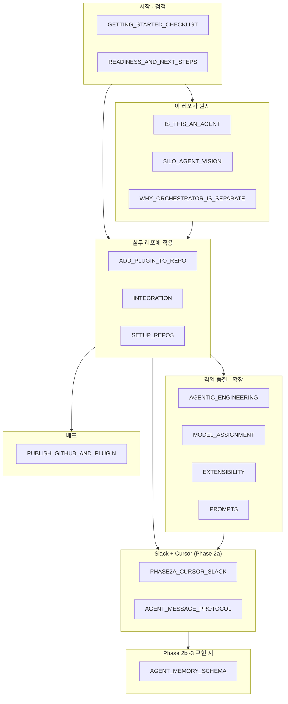
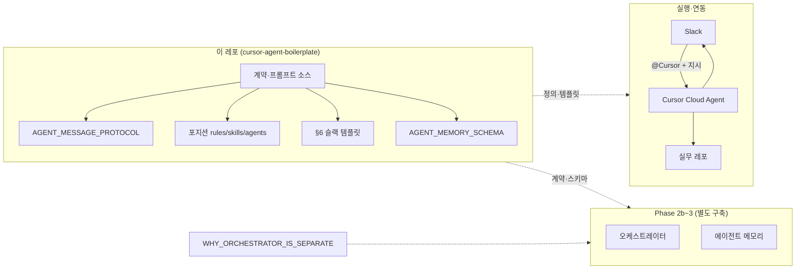
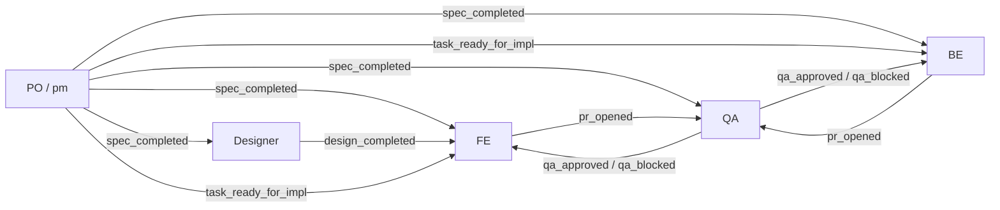
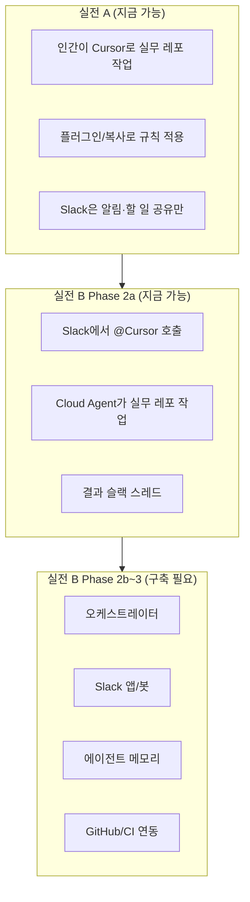

# 전체 흐름 시각화 — docs 전체 기준

> **docs/** 의 모든 문서가 **어디에 쓰이고**, **어떤 순서로 읽으면 되는지** 큰 그림으로 정리합니다.  
> 보일러플레이트 · Slack · 실무 레포 · Phase 2a/2b~3 · 프로토콜 · 확장까지 한 번에 보기 위한 문서입니다.

---

## 1. 문서 지도 — 어떤 문서가 어디에 쓰이는가

---

## 2. 단계별 흐름 — “지금 뭘 하면 되지?”

```mermaid
flowchart LR
  subgraph step0["0. 시작 전"]
    A0[GETTING_STARTED_CHECKLIST]
    A0 --> R0[READINESS_AND_NEXT_STEPS]
  end

  subgraph step1["1. 이해"]
    B1[IS_THIS_AN_AGENT]
    B2[SILO_AGENT_VISION]
    B3[WHY_ORCHESTRATOR_IS_SEPARATE]
  end

  subgraph step2["2. 실무 레포 준비"]
    C1[ADD_PLUGIN_TO_REPO]
    C2[INTEGRATION §1·§2]
    C3[SETUP_REPOS /setup-repo]
  end

  subgraph step3["3. Cursor에서 작업"]
    E1[PROMPTS]
    E2[AGENTIC_ENGINEERING]
    E3[MODEL_ASSIGNMENT]
  end

  subgraph step4["4. Slack 연동 (선택)"]
    F1[PHASE2A_CURSOR_SLACK]
    F2[AGENT_MESSAGE_PROTOCOL §6]
  end

  subgraph step5["5. 확장 (선택)"]
    G1[EXTENSIBILITY]
    G2[PUBLISH_GITHUB_AND_PLUGIN]
  end

  step0 --> step1
  step1 --> step2
  step2 --> step3
  step3 --> step4
  step4 --> step5
```

| 단계 | 문서 | 용도 |
|------|------|------|
| **0. 시작 전** | GETTING_STARTED_CHECKLIST, READINESS_AND_NEXT_STEPS | 완성도 점검, 실전 A vs B, “지금 바로 할 수 있는 것” 확인 |
| **1. 이해** | IS_THIS_AN_AGENT, SILO_AGENT_VISION, WHY_ORCHESTRATOR_IS_SEPARATE | 에이전트 정의, 비전·로드맵, “이 레포 = 계약·소스만” |
| **2. 실무 레포 준비** | ADD_PLUGIN_TO_REPO, INTEGRATION, SETUP_REPOS | 플러그인 추가·복사, 팀 워크플로우, 포지션별 새 레포 세팅 |
| **3. Cursor에서 작업** | PROMPTS, AGENTIC_ENGINEERING, MODEL_ASSIGNMENT | 복사할 프롬프트, 에이전틱 원칙, 모델(Opus/Sonnet/Haiku) 배정 |
| **4. Slack 연동** | PHASE2A_CURSOR_SLACK, AGENT_MESSAGE_PROTOCOL §6 | @Cursor 호출, 이벤트별 슬랙 메시지 템플릿 |
| **5. 확장·배포** | EXTENSIBILITY, PUBLISH_GITHUB_AND_PLUGIN | 도구·MCP 추가, GitHub·마켓플레이스 제출 |

---

## 3. 구성 요소와 문서 연결

- **이 레포**: 계약(이벤트·역할·스키마), 프롬프트 소스, §6 템플릿 → AGENT_MESSAGE_PROTOCOL, WHY_ORCHESTRATOR_IS_SEPARATE, SILO_AGENT_VISION.
- **실행**: Slack + Cursor Cloud Agent + 실무 레포 → PHASE2A, INTEGRATION, ADD_PLUGIN_TO_REPO.
- **Phase 2b~3**: 오케스트레이터·메모리 구축 시 → AGENT_MESSAGE_PROTOCOL, AGENT_MEMORY_SCHEMA, WHY_ORCHESTRATOR_IS_SEPARATE.

---

## 4. 이벤트·역할 흐름 (기획 → 디자인 → 개발 → QA)

- **정의**: AGENT_MESSAGE_PROTOCOL (이벤트 타입, 페이로드, 역할–채널, §6 템플릿).
- **Phase 2a**: 사람이 §6 템플릿 복사 → 슬랙에 붙임 → @Cursor로 해당 역할 작업 지시 → PHASE2A_CURSOR_SLACK.

---

## 5. 실전 A vs 실전 B vs Phase 2b~3

- **실전 A**: READINESS_AND_NEXT_STEPS, GETTING_STARTED_CHECKLIST, INTEGRATION, ADD_PLUGIN_TO_REPO, PROMPTS.
- **Phase 2a**: PHASE2A_CURSOR_SLACK, AGENT_MESSAGE_PROTOCOL §6.
- **Phase 2b~3**: WHY_ORCHESTRATOR_IS_SEPARATE, AGENT_MESSAGE_PROTOCOL 전체, AGENT_MEMORY_SCHEMA, SILO_AGENT_VISION.

---

## 6. docs 전체 — 문서별 용도 한눈에

| 문서 | 용도 | 흐름에서 위치 |
|------|------|----------------|
| **GETTING_STARTED_CHECKLIST** | 바로 해보기 전 완성도·연동 체크리스트 | 시작 전 |
| **READINESS_AND_NEXT_STEPS** | 비전 대비 현황, 실전 A vs B, 체크리스트 | 시작 전 · 방향 선택 |
| **IS_THIS_AN_AGENT** | “에이전트”인지, 서브에이전트·보일러플레이트 의미 | 이해 |
| **SILO_AGENT_VISION** | AI 사일로 비전, 현재 레포 매핑, 로드맵 | 이해 · 비전 |
| **WHY_ORCHESTRATOR_IS_SEPARATE** | 이 레포 = 계약·소스만, Phase 2b~3 = 별도 서비스 | 이해 · Phase 2b~3 |
| **ADD_PLUGIN_TO_REPO** | 특정 레포에 pm/design/frontend-mobile 등 플러그인 추가 | 실무 레포 준비 |
| **INTEGRATION** | 플러그인 vs 복사, Slack 봇·팀 워크플로우(기획→배포) | 실무 레포 · Slack |
| **SETUP_REPOS** | 포지션별 레포 세팅(Java/Next.js/Flutter), /setup-repo | 실무 레포 준비 |
| **PHASE2A_CURSOR_SLACK** | Slack @Cursor, Cloud Agent, 별도 봇 없이 할 일 전달 | Slack 연동 |
| **AGENT_MESSAGE_PROTOCOL** | 이벤트·페이로드·역할–채널·§6 슬랙 템플릿 | Phase 2a · Phase 2b~3 |
| **AGENT_MEMORY_SCHEMA** | 역할별 메모리 필드(thread_id, spec_id, pr_url 등) | Phase 2b~3 구현 |
| **AGENTIC_ENGINEERING** | 에이전트 협업 원칙(분해·DoD·실패 복구 등) | Cursor 작업 품질 |
| **MODEL_ASSIGNMENT** | Opus/Sonnet/Haiku 배정, 서브에이전트 model | Cursor 작업 품질 |
| **EXTENSIBILITY** | 도구·MCP·TOOLS_AND_MCP.md, Slack 확장 | 확장 |
| **PROMPTS** | Cursor 채팅에 복사해 쓸 프롬프트 모음 | Cursor 작업 |
| **PUBLISH_GITHUB_AND_PLUGIN** | GitHub 푸시·플러그인 마켓플레이스 제출 | 배포 |

---

## 7. 한 줄 요약

1. **시작**: GETTING_STARTED_CHECKLIST · READINESS_AND_NEXT_STEPS 로 “지금 뭘 할 수 있는지” 확인.
2. **이해**: IS_THIS_AN_AGENT · SILO_AGENT_VISION · WHY_ORCHESTRATOR_IS_SEPARATE 로 이 레포가 “에이전트 정의·계약·소스”임을 파악.
3. **실무 레포**: ADD_PLUGIN_TO_REPO · INTEGRATION · SETUP_REPOS 로 플러그인/복사·팀 워크플로우·새 레포 세팅.
4. **Cursor 작업**: PROMPTS · AGENTIC_ENGINEERING · MODEL_ASSIGNMENT 로 프롬프트·원칙·모델 배정 적용.
5. **Slack (Phase 2a)**: PHASE2A_CURSOR_SLACK · AGENT_MESSAGE_PROTOCOL §6 로 @Cursor + 템플릿 사용.
6. **Phase 2b~3**: AGENT_MESSAGE_PROTOCOL · AGENT_MEMORY_SCHEMA · WHY_ORCHESTRATOR_IS_SEPARATE 로 오케스트레이터·메모리·별도 서비스 구축.
7. **확장·배포**: EXTENSIBILITY · PUBLISH_GITHUB_AND_PLUGIN 로 도구·MCP 추가 및 GitHub·마켓플레이스 배포.
